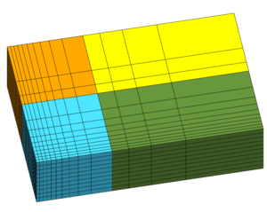

# Gridder

https://meshing.lanl.gov/gridder/gridder.html

GRIDDER is a simple interactive grid generation tool for creating orthogonal, 2D quadralateral or 3D hexahedral grids. Grid spacing can be even, logarithmic, or geometric. Gridder creates orthogonal one-dimensional, two-dimensional, or three- dimensional grids. Each dimension can have multiple regions, each with different nodal spacing. This spacing can be equal spacing, geometric spacing, or logarithmic spacing. The resulting grid can be output in AVS (Advanced Visualization Systems) format or Tracer 3D format. Coordinate and connectivity data are output for AVS, but only coordinate data is output for Tracer3D. 

Running from the command line, Gridder prompts the user for input such as number of dimensions, number of regions in each dimension, coordinates of region borders, number of divisions in each region, spacing specifications of each region, and output format. Gridder can also accept the necessary information from a file, bypassing the interactive interface. Every time the interactive interface is used, the input parameters are saved to a file so that the same grid can be regenerated from that file.

# Copyright and License

Los Alamos National Security, LLC (LANS) owns the copyright to GRIDDER, which it identifies internally as LA-CC-15-082. The license is BSD with a "modifications must be indicated" clause. See LICENSE for the full text.

